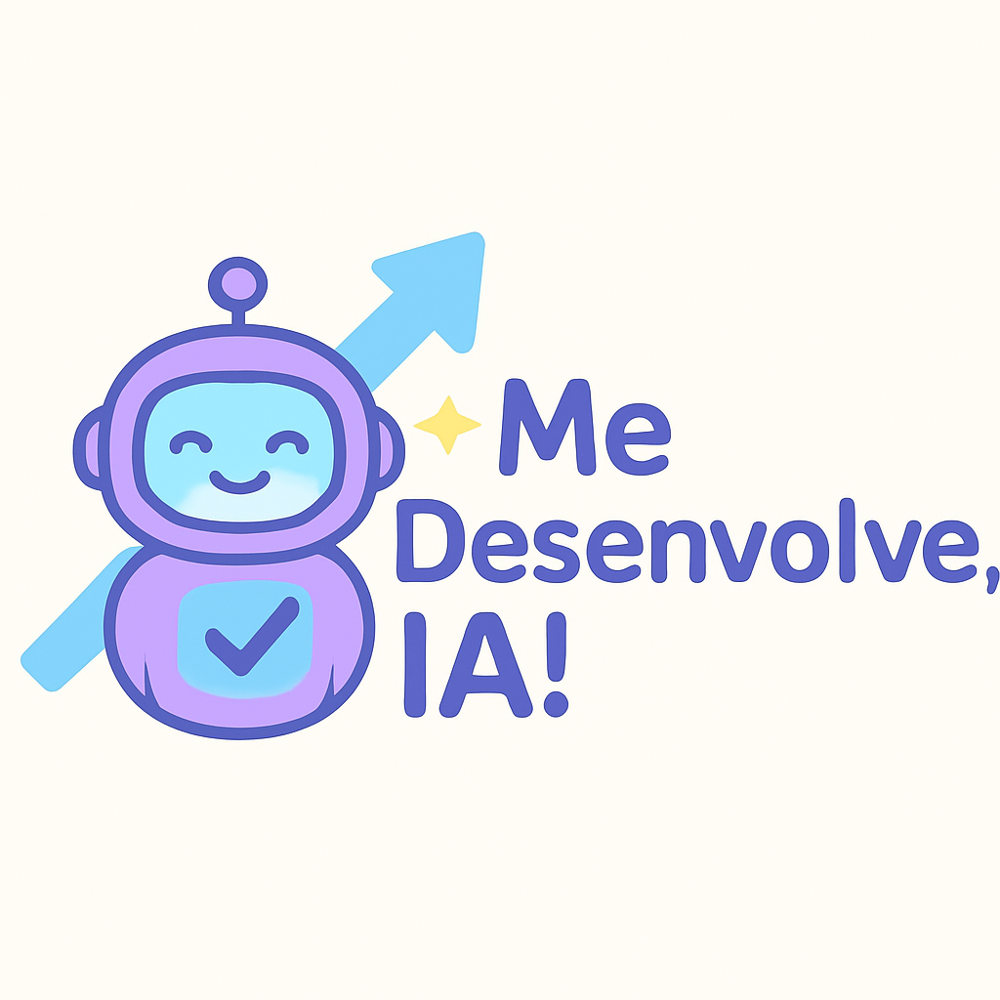

    
    <h3 align="center">Me Desenvolve, IA!</h3>

  Gerador inteligente de Plano de Desenvolvimento Individual (PDI) com IA generativa Gemini do Google.

## ✨ Me Desenvolve, IA!

O **Me Desenvolve, IA!** é um gerador inteligente de **Plano de Desenvolvimento Individual (PDI)** que utiliza o poder da IA generativa do Google, o **Gemini**, para ajudar profissionais a identificarem seus pontos fortes e oportunidades de melhoria.

Nesta primeira versão, o foco está na geração personalizada de planos práticos e acionáveis, com base nas respostas do usuário, aplicando a metodologia **SMART** para garantir clareza e efetividade.

Como evolução futura, planejamos incorporar uma Matriz de Competências para um diagnóstico ainda mais detalhado e orientado.

## 🧭 Contexto do Projeto

Este projeto nasceu durante a imersão promovida pela **Alura** e **Google**, com o objetivo de aplicar tecnologias de IA generativa para apoiar o desenvolvimento profissional de forma prática e acessível.

## 💼 Motivação

Construir um Plano de Desenvolvimento Individual (PDI) efetivo pode ser um grande desafio para muitos profissionais. Além da dificuldade natural de autoavaliação e falta de direcionamento claro, o processo tradicional de elaborar um PDI é geralmente demorado, complexo e exige muito esforço para traduzir habilidades em ações práticas e metas mensuráveis.

O **Me Desenvolve, IA!** surge para facilitar essa jornada, gerando planos personalizados, práticos e focados em resultados, poupando tempo e ajudando no crescimento contínuo com metas claras e atingíveis.

## 🎯 Metodologia SMART

Cada plano gerado pelo Me Desenvolve, IA! segue a metodologia SMART, ou seja, as metas são:

- **S**pecíficas (Específicas)
- **M**ensuráveis
- **A**tingíveis
- **R**elevantes
- **T**emporais

Isso garante que o usuário tenha clareza sobre o que deve ser feito e quando, aumentando as chances de sucesso.

## 🚀 Próximos Passos

- Implementar Matriz de Competências para diagnóstico mais preciso
- Adicionar dashboard visual para acompanhamento do progresso
- Criar interface web e mobile para facilitar o acesso
- Incluir sugestões de recursos de aprendizado integrados ao PDI
- Desenvolver integração com Google Agenda para acompanhamento e lembretes automáticos das metas definidas

## 🙏 Agradecimentos

Agradeço à **Alura** e ao **Google** pela oportunidade e pelo desafio da Imersão IA com Gemini, que possibilitou a criação deste projeto.

## 📜 Créditos

Logo criada a partir de IA especialmente para o projeto.
